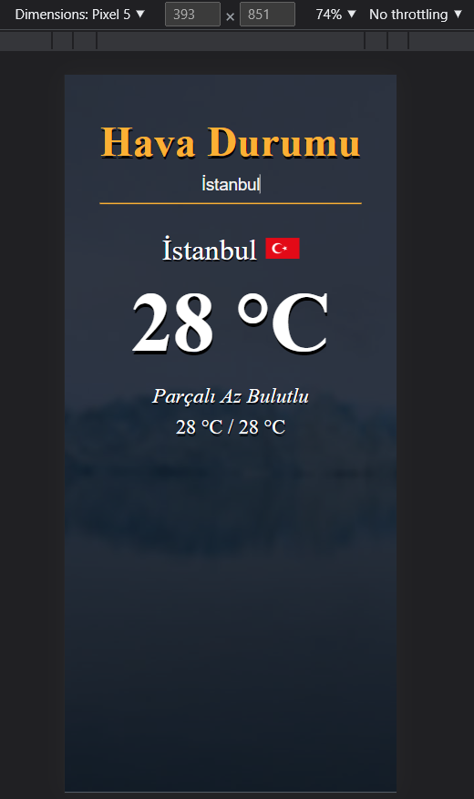

# Hava Durumu Uygulaması

* https://openweathermap.org/api üzerinden gelen sonuçlar üzerine tasarlanmıştır.
* Arka plan resimleri https://picsum.photos/ üzerinden rastgele gelmektedir.
* Weather api üzerinden gelen ülke kodu ile https://countryflagsapi.com/ istek yapılarak bayraklara erişilmiştir.
* Mozilla / Chrome / Edge tarayıcılarda sorunsuz çalışmaktadır.
* Script dosyasında bulunan Key değerini kendi key bilginiz ile değiştirerek sorunsuz kullanabilirsiniz.
    * Key bilgisini Openweather'a kayıt olarak ücretsiz şekilde elde edebilirsiniz.